# Swordsmen v1.0

Videogame created as final assignment project for the class "Introduccion a la Carrera" at the *Instituto de Tecnologia y Estudios Superiores de Monterrey* as part of the Bachleror in Computer Science and Technology Program.

Limited from using full-on game engines(Ex. Unity and UE4) this game was developed with:
- [GameMaker](http://www.yoyogames.com/gamemaker)
- [Adobe](http://www.adobe.com/) Photoshop CS 6 *Trial Version*

The games theme was inspired by old classic 2D sidescrolling games more evidently from the RPG genre like *Castlevania*.

Inital assignment team:
- Eduardo Aguilar Leal
- Jorge Andres Sabella
- Mariana Sofia Pena
- Rodrigo Urbina
- Marcela Rico

10/25/2016

---
## Index

- [Index](#index)
- [Gallery](#gallery)
- [Contributions Guide/Guideline](#contributions-guide/guideline)
  - [Git & Github](#git-and-github)
    - [Mini Github Tutorial](#mini-github-tutorial-reminder)
  - [Levels and Rooms](#levels/rooms)
  - [Collideable tiles/blocks](#collideable-tiles/blocks)
  - [Mobs](#mobs)
- [Links](#links)
- [Assignment Guidelines](#assignment-guidelines)
- [TODOs](#todo)

---
## Gallery

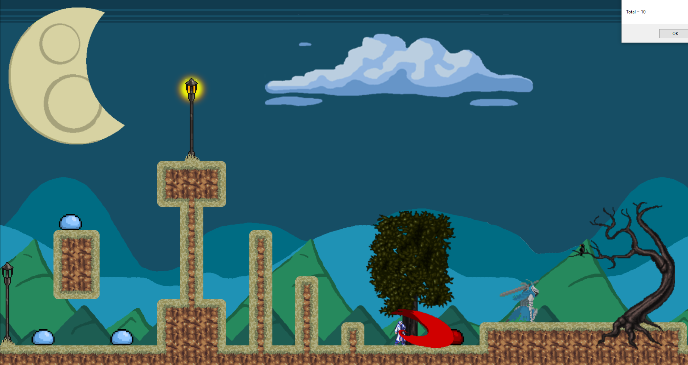
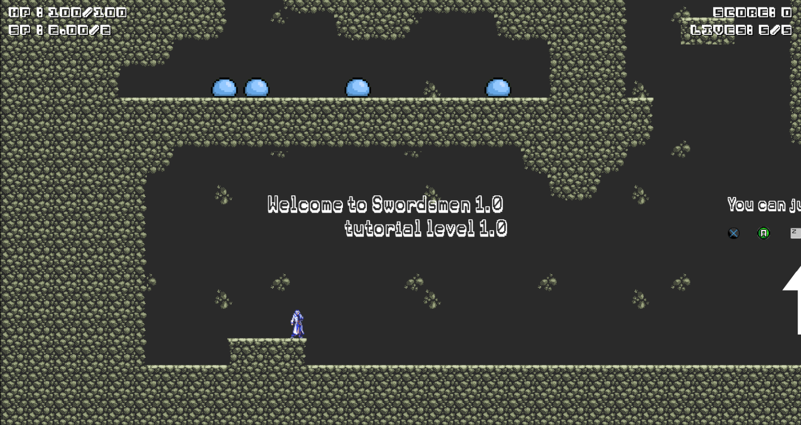
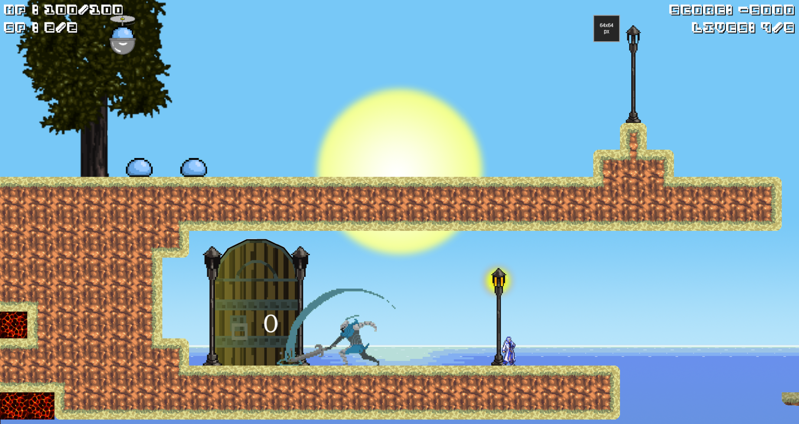

---
## Contributions Guide/Guideline

Equipo, **Porfavor lean** esto antes de hacer cualquier **pull request** y/o **push** al repositorio(si en ingles nimodo, la industria esta en ingles). Estoy tomando en consideracion que esta es probablemnte su primera vez utlizando github.

Team, **Please read** this before attempting any **pull request** and/or **push** into the repository. I am taking into consideration this is your first time using github.

### Git and Github
- From `dev` branch, checkout a new Branch with the command `git checkout -b type/branch_name`. Where type is a general idea of what's implemented. Ex. `fix`, `feature`, `enhancement`, etc.
- **Commits** messeges' must be precise and concise, *please*. Ex `git commit -m "Added mobility to character object"` or `git commit -m "Fixed wall jumping bug"`.
- Grab an issue from the Github repo and try to fix it or something from the TODO list.
- Report issues & TODOs, **please**.

#### Mini Github Tutorial Reminder

Your workflow must be divided into *two* steps:

1. Actual coding and editing files and/or images.
2. Creating git **commits**(saved points in the projects timeline).

At the end you're going to attempt to **push** your changes(**commits**) into the **repository** we all share online. Yet in this case you're going to create a **pull request**, a request to pull those **commits** into the **repository**.

- Git: local version control software used via the temrinal
- Github: Online service that works in conjuction with git

To use Git in your computer you're going to be using your *Terminal* application if you're working on a Mac and if you're working on a Windows you may and I reccomend downloading [GitBash](https://git-scm.com/downloads). (most Macs have preinstalled Git, GitBash is a terminal) 

1. Locate yourself from inside your terminal where you want to clone the **repository**, using the command `cd`. Ex. `cd documents/gamemaker/projects`. This is my folder where I in my computer keep this project.
2. Clone the **repository** `git clone herGoesTheLink`, remeber to press the green button at the upper right conrer inside the github repository to get the link.
  - If you have already previously cloned the **repo** just update it with a **pull** `git pull`.
3. Change yourself from the default `master` branch to the `dev` branch, `git checkout dev`.
4. Once in the dev branch "branch" out to your personal branch, create it, `git checkout YourBranchesName`
5. Do your coding & project contribution.
6. Stage your changes so git can recognize them for the commiting process. `git add .` (stages all files within your folder).
7. Commit your changes with `git commit -m "Commit messege"` 
8. Push your changes into the **repository**, `git push -u origin YourBranchesName`.
9. Once your branch has been pushed, make the pull request inside the github **repository**, we will review this request all of us together to verify it and merge it to the master branch.

### Levels/Rooms

When creating a room be certain of it:

- Follows the correct namespace `level_#` were `#` is the number designated to your level and it being at the correct `rooms` folder.
- Having under the **settings** tab:
  - it's speed set to 60 (60 frames per second)
- Having its snap set to **x: 60**, **y:60** (This is optional but higly recomended, all tiles are 60x60 pixels)

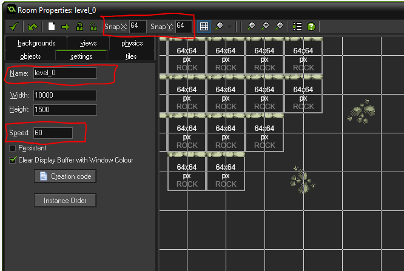
- Having under the views tab
  - enabled the options 
    - [x] Enable the use of views
    - [x] Visible when room starts
  - View in room width set to 1920, height set to 1080.
  - Port on scren width set to 1920, height set to 1080.
  - Object following must be `obj_mc` (possible to change in the future)

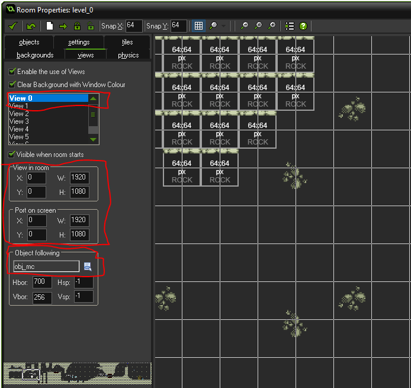
- Having the object `obj_player_spawn` placed somewhere inside the room where you wish the player to initialy start.

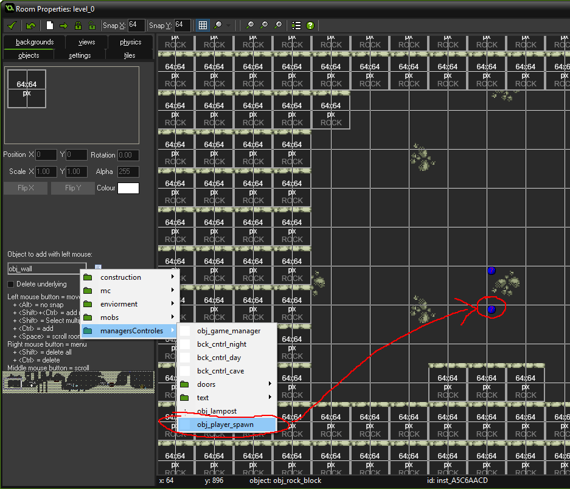
This guidelines just include the necessary elements to add to a room for it to function properly as a level. For further development like moveable background/parallax you need to include the apropiate `obj_bck_cntrl` object and its background layers. For reference you may check `level_0` or `level_select`.

### Collideable tiles/blocks

When creating a block that will collide with players and moves be sure of it:

- Having a sprite that is 60x60 pixels.
- Having it's sprite origin at the center of it.

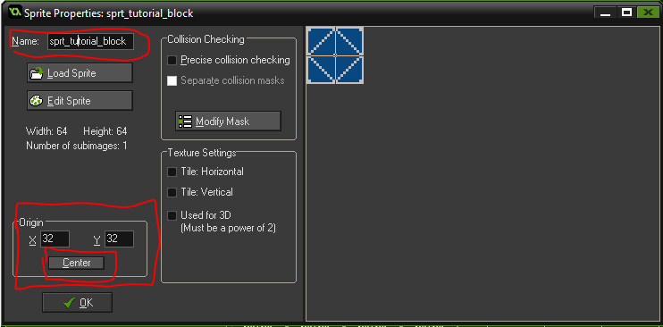
- Being a child of `obj_wall`.

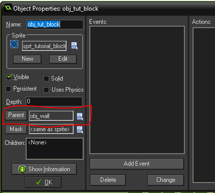

### Mobs

When creating a mob(enemy character) object be ceratin of it:

- Follows the correct namespace for it's sprite `sprt_mob_mobsName` and being at the correct `sprites/mobs` folder.
- Having it's sprite's origin at the center of it.

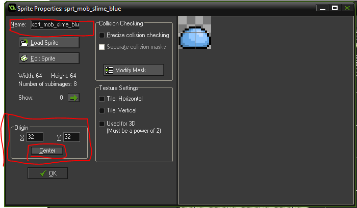
- Follows the correct namespace `obj_mob_mobsName` and being at the correct `objects/mobs` folder.
- Being a **child** of `obj_mob_father` & its depth being -4.
- Having at the `create` **event** the necessary variables for it to function properly as a mob.
  - `kill_score` (**integer**, It is the scores the players recieve when killing it).
  - `hp` (**integer**, enemy's health or hit points).
  - `attacking` (**boolean**, it defines if the object is in an attacking state, you define when/where).
  - `damage` (**integer**, the damage/hitPoints it subtracts from the player when colliding with it).
  - `attack_damage` (**integer**, the damage/hitPoints it subtracts from the player when colliding with it in the attacking state).
  - `can_take_damage = true` (**boolean**, it defines if the mob can recieve damage at a given time, must be initialized as `true`)

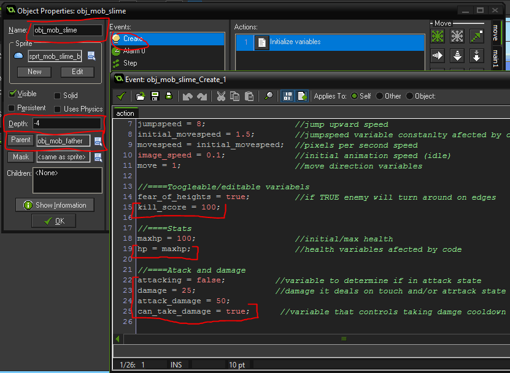
- Having a `alarm[0]` **event** with the code for damage and dead management (_check mob_slime for reference and copy/paste_).

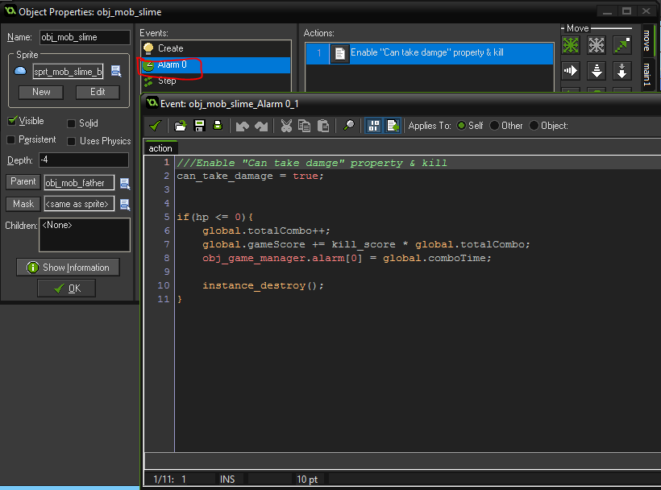
- Having in its `step` **event** the code for player attack detection and damage detection/animation.

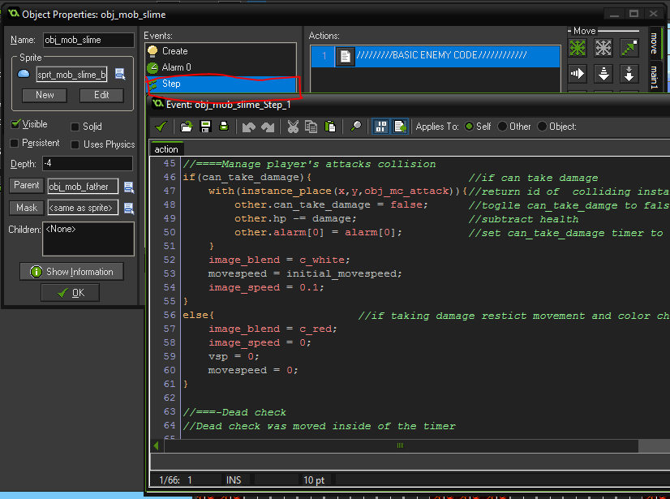

This guidelines create an unmoveable mob object that can recieve and cause damage by touch. For collsion, movement and AI management I suggest using as reference `obj_mob_slime` or `obj_mob_knight`. Feel free to craft any kind of enemy you like.

---
## Links

Feel free to add any guides/videos/resources that have had helped you in the process, it might help the others.

- [GameMaker Documentation](http://docs.yoyogames.com/)
- [Great Gamemaker tutorials by Shaun Spalding](https://www.youtube.com/channel/UCn7FE3Tx391g1tWPv-1tv7Q)

---
## TODO

Feal free to write anyhting we are missing and need to tackle.
- Main Menu
  - Play
  - Settings
    - Sound
    - Input
    - Graphics
  - Quit
- 3/15 desired mobs implemented.
  - ~~Slime~~
  - ~~Knight~~
  - ~~Flypod slime~~
- 1/5 desired levels implemented.
  - level-select level (in constant progress)
  - ~~tutorial level~~ 
- Ambient music.
- Sound effects.
- Local Multiplayer.
- Story...

---
## Assignment Guidelines

#### PROYECTO FINAL - segunda parte: _Construccion de un Videojuego Interactivo_

##### Objetivo

Haciendo un videojuego interactivo, los estudiantes que comienzan sus estudios en Tecnologias Computacionales, podran desarrollar las siguientes habilidades:  

- Trabajo en equipo con Aprendizaje Colaborativo
- Desarrollo de un producto terminado, hecho y presentado con alta calidad
- Analisis y evaluacion de requerimientos generales
- Dise;o de solucionespara satisfacer requisitos de software

##### Caracteristicas del juego

Las siguientes caracteristicas se consideran esenciales para undesarrollo minimo de un videojuego:

1. _Tematica libre_
2. _Equipo conformado por 4 o 5 personas._
3. _Interaccion constante con el usuario; las acciones del usuario desenvuelven la trama del videojuego. El jugador recibe constante retroalimentacion visual y sonora_
4. _Mantener una evaluacion del desempe;o del usuario (puntaje, porcentaje de avance, etc.)._
5. _Entregar un manual por escrito donde se explique cual es el objetivo del videojuego, y como se utliza (deb de ser visual, usando screenshots o screen grabs)._

Las siguientes caracteristicas no son requeridas, pero se tendran consideraciones especiales a los productos que manejen. Caracteristicas avanzadas:

1. _Manejo de niveles, o diferentes escenas._
2. _Interaccion con mas de un jugador_

##### Entregas:

1. Una descripcion de la Historia, asi como la definicion de la herramienta que se usara en el desarrollo (se hara en BB).
2. Algunos storyboards donde se presenten "prototipos de alto nivel", (Puede ser hecho a mano), se subira la imagen a Blackboard.
3. El videojuego funcional, bien documentado y con Buena presentacion.
4. Exposcicion y "venta"(pitch) de su Videojuego ante un jurado externo.
5. Los finalistas de la Expo haran su presentacion ante el grupo pleno en la fecha del Final.

##### NOTA:

Una sugerencia es que usen SCRATCH (scratch.mit.edu). Si deciden que NO quieren usarla, si podran usar alguna otra herramienta, sin embargo tiene 2 restricciones:

1. Es necesario validarla con nosotros (enviar mail a _itc.mty@gmail.com_ incluyendo los datos de los miembros del equipo y cual tecnologia usaran);
2. TODOS los miembros del equipo deben saber/aprender esa tecnologia, ya que se trata de un proyecto de aprendizaje colaborativo!!

##### EVALUACION FINAL

- Los miembros del equipo que el jurado considere ganador, se haran acreedores a 100 final de calificacion en la materia.
- Mas adelante se proporcionara informacion sobre los aspectos que seran evaluados.

